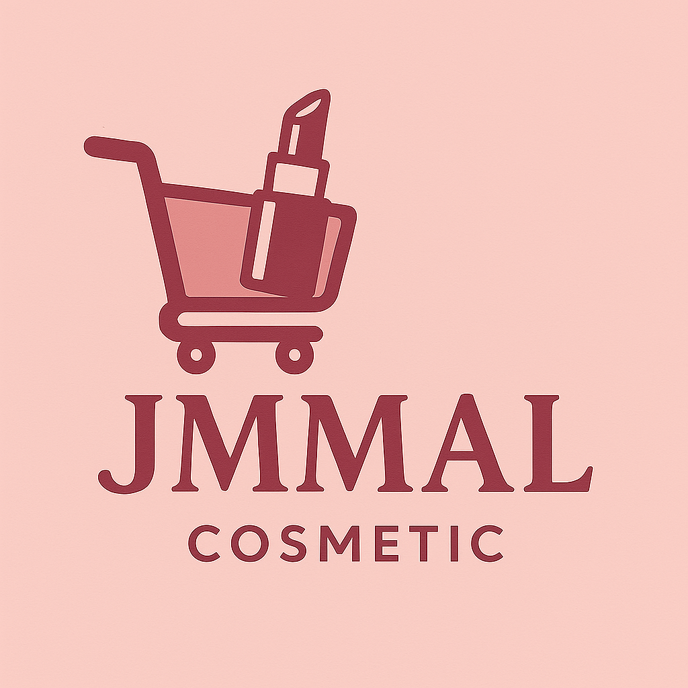

# ✨ JMAL Cosméticos - Tienda Online de Belleza Femenina ✨

<p align="center">
  
</p>

¡Bienvenida a JMAL Cosméticos! Una elegante y moderna tienda en línea dedicada a ofrecer productos de belleza de alta calidad para realzar la belleza única de cada mujer. Este proyecto es un sitio web de comercio electrónico completamente funcional construido con HTML5, CSS3 y JavaScript puro, utilizando el framework Bootstrap 5 para un diseño responsivo y atractivo.

---

**📍 Ubicación del Proyecto:** Valledupar, Cesar, Colombia.

---

## 🎯 Características Principales

* 💄 **Catálogo de Productos Dinámico:** Visualiza una variedad de cosméticos con descripciones, precios e imágenes.
* 🛍️ **Carrito de Compras Funcional:** Añade, actualiza cantidades y elimina productos. El carrito persiste usando `localStorage`.
* 💅 **Diseño Responsivo y Moderno:** Interfaz amigable y adaptable a dispositivos móviles, tablets y escritorio, gracias a Bootstrap 5.
* 🎨 **Estilo Femenino y Elegante:** Paleta de colores centrada en tonos rosas y blancos para una experiencia visual agradable.
* 📄 **Navegación Completa:**
    * **Inicio:** Con carrusel de imágenes y destacados.
    * **Productos:** Listado completo de artículos disponibles.
    * **Acerca de Nosotras:** Conoce la misión, visión y al equipo de JMAL.
    * **Carrito:** Resumen detallado de la compra.
    * **Contacto:** Información de contacto, mapa de ubicación y formulario.
* ✨ **Notificaciones Interactivas:** Alertas tipo "toast" de Bootstrap para confirmar acciones (ej. producto añadido al carrito).
* 💬 **Modales de Confirmación:** Para acciones importantes como vaciar el carrito o proceder al pago, mejorando la experiencia de usuario.
* 🗺️ **Mapa de Ubicación:** Integración con Google Maps en la página de contacto.
* 📝 **Formulario de Contacto:** Interfaz para que los usuarios envíen consultas (frontend únicamente, requiere backend para funcionalidad completa).

---

## 🛠️ Tecnologías Utilizadas

* **HTML5:** Para la estructura semántica del contenido.
* **CSS3:** Para los estilos personalizados y el diseño visual.
    * **Bootstrap 5.3.3:** Framework CSS para un diseño responsivo y componentes predefinidos. ([Ver documentación](https://getbootstrap.com/docs/5.3/))
* **JavaScript (ES6+):** Para la interactividad, manipulación del DOM, lógica del carrito y notificaciones.

---

## 🏁 Cómo Empezar (Desarrollo Local)

Sigue estos pasos para ejecutar el proyecto en tu máquina local:

1.  **Clona el repositorio:**
    ```bash
    git clone https://URL_DE_TU_REPOSITORIO_EN_GITHUB_AQUI
    ```
2.  **Navega a la carpeta del proyecto:**
    ```bash
    cd ecommerce_cosmetic
    ```
3.  **Abre `index.html` en tu navegador:**
    Simplemente haz doble clic en el archivo `index.html` o ábrelo desde tu navegador web preferido.

¡Y eso es todo! No se requiere instalación de dependencias adicionales ni procesos de compilación para este proyecto frontend.

---

## 📖 Uso del Sitio Web

* **Navegación:** Utiliza la barra de navegación superior para moverte entre las diferentes secciones: Inicio, Productos, Acerca de Nosotras, Carrito y Contacto.
* **Explorar Productos:** En la página "Productos", encontrarás el catálogo completo. Cada producto muestra su imagen, nombre, descripción y precio.
* **Añadir al Carrito:** Especifica la cantidad deseada y haz clic en "Agregar" para añadir un producto a tu carrito.
* **Gestionar Carrito:** En la página "Carrito", puedes ver todos los productos seleccionados, modificar las cantidades o eliminar artículos. El subtotal, IVA y total a pagar se calculan automáticamente.
* **Finalizar Compra (Simulado):** Haz clic en "Proceder al Pago". Esta acción es simulada y limpiará el carrito.
* **Vaciar Carrito:** Puedes eliminar todos los productos del carrito con un solo clic.
* **Contacto:** Visita la página "Contacto" para ver la información de la tienda, el mapa de ubicación o enviar un mensaje a través del formulario (simulado).

---

## 🔧 Puntos Clave para Personalización (¡Importante!)

Para adaptar completamente este sitio a tu marca JMAL, asegúrate de revisar y actualizar lo siguiente:

* **Definición de Productos (`script.js`):**
    * Modifica el array `productosJMAL`. Cada objeto de producto debe tener: `id`, `nombre`, `precio`, `descripcion`, y `imagen` (ruta correcta al archivo en `ecommerce_cosmetic/imagenes/`).
* **Imágenes:**
    * **Productos:** Asegúrate de que todas las imágenes de productos listadas en `script.js` existan en la carpeta `ecommerce_cosmetic/imagenes/`.
    * **Carrusel (`index.html`):** Reemplaza `banner1.jpg`, `banner2.jpg`, etc., con tus imágenes de banner.
    * **Sección "Acerca de" (`acerca.html`):** Actualiza `mision_imagen.jpg` y `vision_imagen.jpg` con imágenes representativas.
    * **Favicon:** Si tienes un favicon, actualiza la ruta en el `<head>` de cada HTML.
* **Información de Contacto (`contacto.html`):**
    * Introduce el correo electrónico oficial, teléfono principal y dirección física de JMAL Cosméticos.
    * Actualiza el enlace de WhatsApp General.
    * **Fundamental:** Reemplaza el `src` del `<iframe>` del mapa con el código de inserción de Google Maps correspondiente a la **ubicación real** de JMAL.
* **Textos de la Marca:**
    * Revisa y ajusta la **Misión** y **Visión** en `acerca.html` para que reflejen fielmente los valores de JMAL.
    * Actualiza el texto del pie de página si es necesario.
* **Formulario de Contacto (`contacto.html`):**
    * La funcionalidad de envío de correo **no está implementada** (es solo frontend). Para que los mensajes se envíen realmente, necesitarás integrar una solución de backend (ej. PHP, Node.js, o servicios como Formspree, Netlify Forms).

---

## 💖 El Equipo JMAL

Este proyecto fue desarrollado con la colaboración de:

* Jesús Carvajal
* María García
* Andrés Zapata
* Marlon Martínez
* Lorena

---

## 💬 Contacto

Para cualquier consulta, sugerencia o soporte relacionado con este proyecto, por favor utiliza la información proporcionada en la página de "Contacto" del sitio web.

---

¡Gracias por visitar JMAL Cosméticos! Esperamos que disfrutes la experiencia. 💄🛍️
